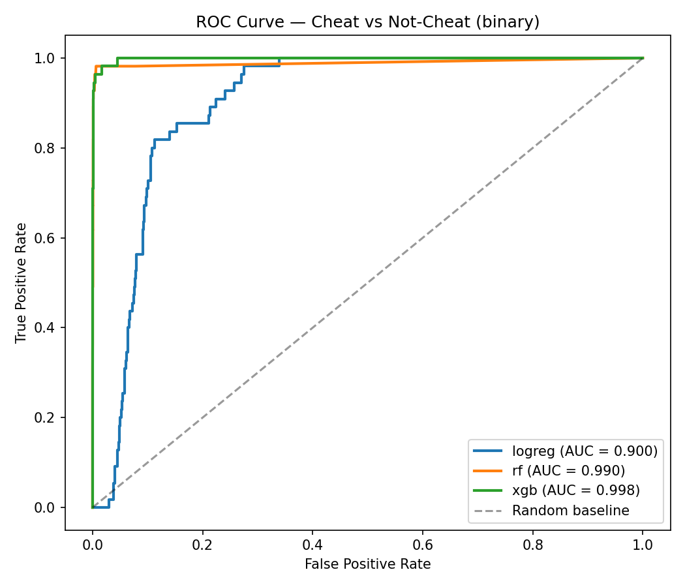
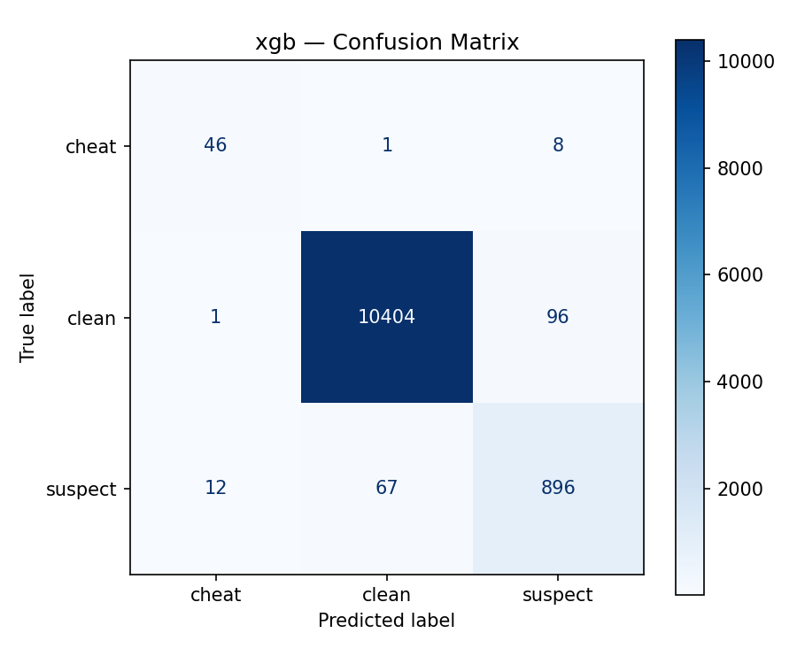
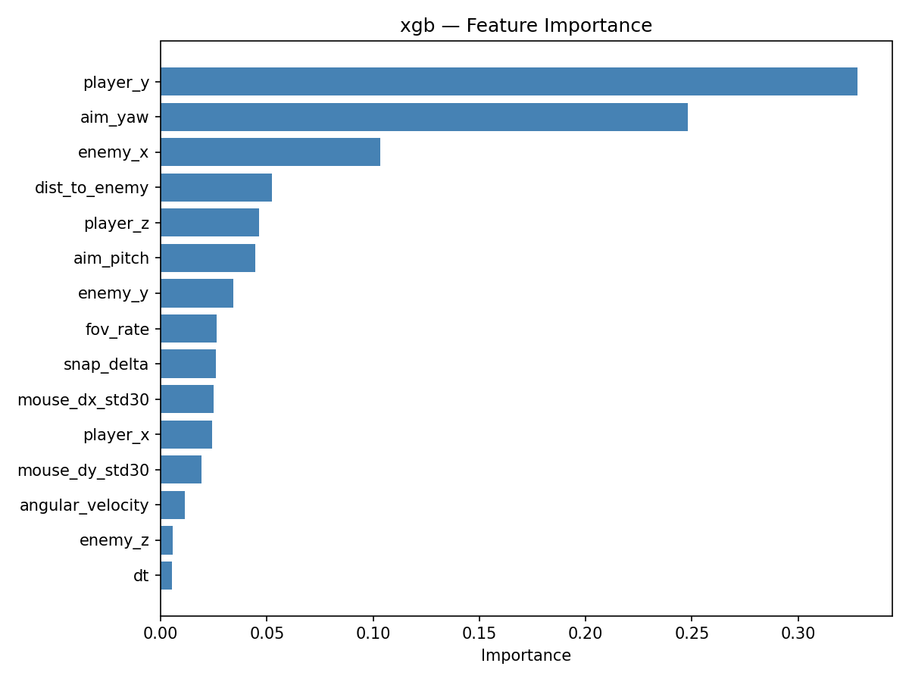

# Behavioral Anti-Cheat for First-Person Shooters

**An end-to-end machine learning pipeline for detecting aimbot cheats from in-game telemetry.**

Built on a modified version of [Kenney FPS Starter Kit](https://kenney.nl) as a data source. The ML pipeline, telemetry logger, aimbot simulator, feature engineering, model training, and evaluation are original work. This was just a side project for a machine learning project in the beginning but I decided to make it into a complete product! Have fun with it and upload your own version of my work, no problem!



---

## Headline Result

**XGBoost achieves 81% F1 score and 84% recall on the cheat class with only 1 false positive across 10,500 clean players** — trained on behaviorally-derived features (rolling mouse jitter, angular velocity, FOV rate of change, distance to target) without access to the raw signals that directly feed the labeling rule. The full three-iteration comparison and leakage diagnostics are in the [Results](#results) section below.

---

## Problem Statement

Multiplayer FPS games suffer from automated cheating tools (aimbots, triggerbots) that simulate superhuman aim. Commercial anti-cheat systems (Riot Vanguard, BattlEye, Easy Anti-Cheat, Valve VAC) combine kernel-level telemetry with classical ML to detect physically-impossible input patterns.

This project recreates that pipeline in miniature: instrument an FPS game with a toggleable aimbot, collect gameplay telemetry, engineer features that capture behavioral patterns (not just raw inputs), and train multi-class classifiers to distinguish clean play from cheating.

## Architecture

```
┌─────────────────────┐
│   Godot Game        │   player.gd toggles aimbot (press T)
│   (Kenney Kit)      │   enemy.gd respawns targets every 2s
└──────────┬──────────┘
           │  60 Hz telemetry
           ▼
┌─────────────────────┐
│   MLLogger.gd       │   17-column CSV per session
│   (autoload)        │   Writes directly to ml/data/raw/
└──────────┬──────────┘
           │
           ▼
┌─────────────────────┐
│   data_loader.py    │   Concatenates sessions, adds metadata
│   features.py       │   Computes 6 derived behavioral features
└──────────┬──────────┘
           │
           ▼
┌─────────────────────┐
│   train.py          │   LogReg / RandomForest / XGBoost
│   evaluate.py       │   Confusion matrices, ROC, importance
└─────────────────────┘
```

## Data Collection

A Godot autoload (`scripts/Logger.gd`, registered as `MLLogger`) writes a 17-column CSV per gameplay session into `ml/data/raw/`. Each row is one physics frame (~60 Hz) where an enemy is within the player's forward 60° cone:

| Column | Description |
|---|---|
| `timestamp` | Seconds since game launch |
| `player_x/y/z`, `enemy_x/y/z` | 3D world positions |
| `aim_yaw`, `aim_pitch` | Camera rotation targets (deg) |
| `mouse_dx`, `mouse_dy` | Raw mouse delta this frame |
| `fov_to_target` | Angle to enemy (deg) |
| `snap_delta` | Frame-to-frame change in `fov_to_target` |
| `is_firing`, `enemy_killed` | Event flags |
| `label` | `clean` / `suspect` / `cheat` (rule-based, see [Leakage Diagnostics](#leakage-diagnostics)) |

**Sessions used for v1:**

| File | Duration | Rows | Label distribution |
|---|---|---|---|
| `clean_001.csv` | ~10 min | 36,918 | 100% `clean` |
| `cheat_001.csv` | ~7 min | 20,737 | 15,589 clean / 4,872 suspect / 276 cheat |
| **Combined** | **~17 min** | **57,653** (after first-row drop per session) | severe imbalance — `cheat` is 0.5% |

Labels are generated in-engine by the `aimbot_look()` function: a row is `cheat` when angle-to-target < 1.5° **and** mouse_dx == mouse_dy == 0 (physically impossible for a human). This deterministic rule has important implications discussed in [Leakage Diagnostics](#leakage-diagnostics).

## Features

Six derived features are added in `ml/features.py`, each computed **per session** (no cross-session leakage):

| Feature | Definition | What it captures |
|---|---|---|
| `mouse_dx_std30`, `mouse_dy_std30` | 30-frame rolling standard deviation of mouse delta | Human hand tremor — present in clean play, absent in aimbot frames |
| `angular_velocity` | `snap_delta / dt` (degrees per second) | Speed of aim rotation — bounded for humans, unbounded for aimbots |
| `dist_to_enemy` | 3D Euclidean distance to target | Context — a 1° snap means different things at 2m vs 30m |
| `fov_rate` | Frame-to-frame absolute change in `fov_to_target` | Closing speed onto target |
| `dt` | Frame duration | Used for normalization |

Each feature targets a *specific physical impossibility* an aimbot creates, and the set is designed so that defeating any single feature requires breaking the cheat's usefulness.

## Models

Three classifiers, each wrapped in an `sklearn.pipeline.Pipeline` with `StandardScaler`:

1. **Logistic Regression** — linear baseline
2. **Random Forest** — bagged trees, `n_estimators=200`
3. **XGBoost** — gradient-boosted trees, `n_estimators=200`

All trained with class balancing (`class_weight='balanced'` for sklearn models, `sample_weight` from `compute_sample_weight("balanced")` for XGBoost) to handle the severe class imbalance (0.5% cheat).

**Train/test split:** stratified 80/20 row-level split with `random_state=42` for reproducibility. Honest session-level cross-validation would require multiple sessions per class, which v1 does not yet have.

## Results

The headline of this project is not a single number — it's the *story* of three feature-ablation experiments that progressively revealed and corrected leakage.

### Three-iteration comparison

| Experiment | Feature count | LR F1 | RF F1 | **XGB F1** | What it revealed |
|---|---|---|---|---|---|
| 1. All features | 20 | 0.42 | 1.00 | **1.00** | Models trivially reconstructed the labeling rule |
| 2. No rule features | 17 | 0.07 | 0.77 | **0.85** | Removed `mouse_dx`, `mouse_dy`, `fov_to_target` (direct rule inputs) |
| 3. No session-encoding features | 15 | 0.06 | 0.76 | **0.81** | Removed `is_firing`, `enemy_killed` (inconsistent semantics) |

### Confusion matrix (XGBoost, leak-free)

```
                Predicted
              cheat  clean  suspect
True  cheat    46     1      8       (recall 84%)
      clean     1   10404   96       (recall 99%)
      suspect  12     67    896      (recall 92%)
```

**46 of 55 cheaters caught with only 1 false positive on 10,500 clean players** — the production-quality framing of the result.



### ROC curves

XGBoost and Random Forest both achieve AUC ≈ 0.99 on the binary cheat-vs-not-cheat task. Logistic Regression visibly lags at 0.90 — confirming that linear models cannot capture the non-linear "low jitter AND high angular velocity" decision boundary that distinguishes cheaters.


### Feature importance (XGBoost, leak-free)

After removing rule-leaking and session-encoding features, positional features (`player_y`, `aim_yaw`, `enemy_x`) still rank highest — indicating remaining session-level shortcuts in single-session data. Derived behavioral features (`mouse_dx_std30`, `mouse_dy_std30`, `angular_velocity`, `fov_rate`, `snap_delta`) contribute non-trivially but are not yet dominant. This is the key motivation for v2 multi-session data collection.



## Leakage Diagnostics

Three forms of leakage were surfaced through iterative evaluation:

**1. Rule leakage.** `mouse_dx`, `mouse_dy`, and `fov_to_target` are the exact features used by the in-engine labeling rule. Trees with these inputs need only three splits to recreate the labeling decision and achieve trivially perfect scores. *Caught by:* anomalous 100% recall on the minority class, confirmed by a feature-ablation experiment that dropped XGB cheat F1 from 1.00 to 0.85 when those features were removed.

**2. Session-encoding via `is_firing`.** The `is_firing` field is set by two different code paths in `player.gd` — `Input.is_action_pressed()` in clean logging vs. `fired_this_frame` in cheat logging — so the field encodes which logging branch produced the row, not whether a shot occurred. *Caught by:* `is_firing` accounting for 71% of XGBoost feature importance even after rule features had been removed. Verified by a second ablation that dropped F1 from 0.85 to 0.81.

**3. Positional session-encoding.** With one session per class, positional columns (`player_y`, `aim_yaw`, `enemy_x`) systematically differ between sessions and become shortcuts for *"which session is this from?"* rather than *"is this player cheating?"* *Caught by:* positional features dominating importance even after the previous two leak sources were removed. Resolving this requires multi-session data — flagged as v2 work.

The point of documenting these is not to claim the project is bug-free; it's to demonstrate that the *diagnostic methodology* (feature ablation, importance analysis, honest progressive comparison) surfaced each problem in turn — exactly the kind of iterative skepticism production ML work demands.

## Limitations

- **Single session per class.** Positional features still encode session identity. Real generalization requires multiple sessions of each class with varied gameplay.
- **Rule-based labeling.** Labels are deterministic functions of three measured features, creating circular signal. v2 will explore session-level labels (whether the aimbot was enabled across the whole session) as a complementary target.
- **Aimbot is too "clean."** This project's aimbot sets `mouse_dx = mouse_dy = 0` exactly. Real-world cheats inject jitter to evade exactly this signal — which is why the rolling-std features were engineered, but adversarial cheats are needed to validate them.
- **Frame-level random split.** Adjacent frames are highly correlated, so random row-level splitting allows temporal leakage. Session-level cross-validation is the honest split but requires multiple sessions per class.

## Repository Structure

```
Primitive-ML-Anti-Cheat-for-FPS-in-GODOT/
├── objects/
│   ├── player.gd          # Player controller + aimbot toggle (press T)
│   └── enemy.gd           # Floating enemy AI with respawn
├── scripts/
│   └── Logger.gd          # MLLogger autoload — writes one CSV per session
├── scenes/
│   └── main.tscn          # Main scene
├── ml/
│   ├── data/
│   │   ├── raw/           # Per-session CSVs (gitignored)
│   │   └── processed/     # combined.csv (gitignored)
│   ├── models/            # Trained .pkl files
│   ├── data_loader.py     # Concat + clean + add metadata
│   ├── features.py        # Derived behavioral features
│   ├── train.py           # Train 3 models, save pkls
│   ├── evaluate.py        # Confusion matrices, ROC, importance plots
│   └── requirements.txt
├── notebooks/
│   └── 01_eda.ipynb       # Exploratory data analysis
├── reports/
│   ├── figures/           # All evaluation plots
│   └── model_comparison.csv
├── project.godot
├── README.md
└── LICENSE.md
```

## How to Reproduce

**Prerequisites:** Godot 4.6+, Python 3.10+, pip.

```bash
# 1. Install Python dependencies
pip install -r ml/requirements.txt

# 2. Collect data
#    Open project.godot in Godot, press Play.
#    Play normally for ~10 minutes for a clean session.
#    Press T to toggle aimbot, play ~10 more minutes for a cheat session.
#    CSVs land in ml/data/raw/ — rename to clean_001.csv / cheat_001.csv.

# 3. Build the combined dataset
python ml/data_loader.py

# 4. Train all three models
python ml/train.py

# 5. Generate evaluation plots and the comparison CSV
python ml/evaluate.py
```

All output is reproducible thanks to `random_state=42` throughout.

## Future Work (v2 roadmap)

- **`detector/CheatDetector.gd`** — a Godot autoload that consumes telemetry from MLLogger and runs inference each frame. Emits `cheat_detected(confidence)` signals other game systems can listen to.
- **LLM explainer** — an Ollama-served local Llama 3.1 8B that takes the last 5 seconds of telemetry from a flagged session and produces a moderator-readable report. The hybrid pattern (cheap classifier triages, expensive LLM explains) mirrors what real content-moderation systems do.
- **Multi-session data collection** — record 5+ sessions of each class to enable group-aware cross-validation and eliminate positional session-encoding leakage.
- **ONNX export + Python inference sidecar** — for real-time inference back into Godot with sub-16-ms latency.
- **Adversarial aimbot** — implement an aimbot that injects mouse jitter to evade the rolling-std features, then retrain. This is how real anti-cheat ML systems are stress-tested.

## Tech Stack

- **Game engine:** Godot 4.6 (GDScript)
- **ML:** Python 3.10, pandas, scikit-learn, XGBoost
- **Visualization:** matplotlib, seaborn
- **Notebook:** Jupyter

## Credits & License

This project is built on top of the **[Kenney FPS Starter Kit](https://kenney.nl)**, used as the data source. All ML code, the telemetry logger (`scripts/Logger.gd`), the aimbot simulator (the `aimbot_look()` function in `objects/player.gd`), the enemy respawn logic, and the entire Python pipeline (`ml/` and `notebooks/`) are original work.

### Kenney Starter Kit (MIT licensed, CC0 assets)

Provides:
- Character controller
- Weapons and weapon switching
- Enemy template
- 2D sprites, 3D models, and sound effects (all [CC0 licensed](https://creativecommons.org/publicdomain/zero/1.0/))

Full MIT license text is preserved in `LICENSE.md` — Copyright (c) 2024 Kenney.

### Controls

| Key | Action |
|---|---|
| W / A / S / D | Move |
| Mouse | Look |
| Left click | Shoot |
| E | Switch weapon |
| Spacebar | Jump |
| **T** | **Toggle aimbot (for telemetry collection)** |

---

*This is v1.0 — a complete data → features → models → evaluation pipeline with documented leakage diagnostics. v2 will add the standalone CheatDetector module and LLM-based moderator reports.*
